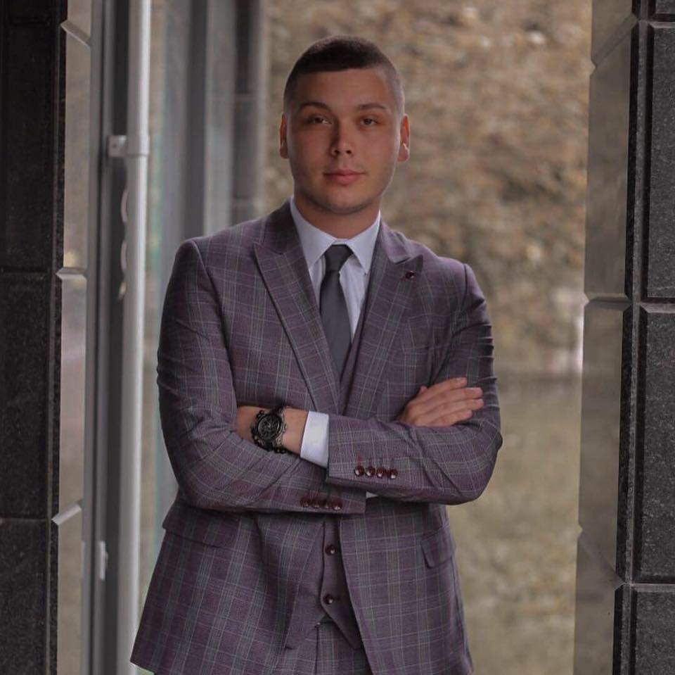
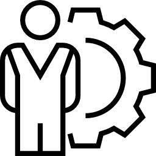
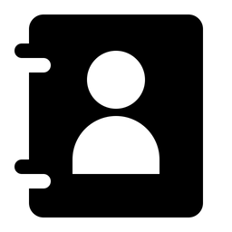

# Project1_EldinCurovac
This is the first project from CS412-Web Application Development
<!DOCTYPE html>
<html lang="en">
  <head>
    <meta charset="UTF-8" />
    <title> CV - Eldin Curovac</title>
  </head>
  <body>
      <figure>
    <h1><ins>Biography</ins></h1>
    
    </figure>
    <blockquote>
      

        Hello! My name is <strong>Eldin Curovac</strong> and I am a student of
        the
        <em
          >3rd year of <abr title = "Software Engineering">SE</abr>, <abr title= "Faculty of Engineering
          and Natural Sciences">FENS</abr> at <abr title= "International University of Sarajevo" > IUS </abr></em>. My tution fee per year was <s>6000€</s>, but with 60% of the scholarship I pay <ins>2400€</ins>. 
      

    </blockquote>
     
    

    <h2><strong>PROFILE</strong>  </h2>
    

    <blockquote>
      

        Throughout the CV you can find out that I am very
        <strong
          >sociable, communicative, open and a person willing to work both alone
          and with a group of people,</strong
        >
        in a team. My two biggest interests are <strong>programming</strong> and
        <strong>social interaction</strong>
        with people. I find that there are many jobs that just connect these two
        interests of mine. I find that I have an advantage because I speak and
        write English fluently, but I also understand Turkish. In addition, my
        mother tongue is Bosnian, and therefore I speak and write Serbian,
        Croatian and Montenegrin fluently.
      

    </blockquote>
  
   
  

  <h2><em>EDUCATION</em>  </h2>
  

  <blockquote>
     
    <ol>
      <li>
        <h3>HIGHER EDUCATION</h3> 
        
<em>2019 – present</em>
 
        
<strong>International University of Sarajevo,
            Faculty of Engineering and Natural sciences, Department of Engineering,
            Software engineering Program</strong>
             
            
I am currently a second year student of
                Software Engineering at the Faculty of Engineering and Natural Sciences.
                In the first year, I passed courses related to programming in two
                programming languages (C ++ and Java). I have projects from both
                programming languages. In addition, I have completed a <em>Software
                    Construction course, but also Calculus 1 and Calculus 2, as well as
                    Turkish Language, Understanding Science and Technology , Academic
                    Writing and Reading, Programming Languages, Introduction to Probability
                    and Statistics, Project Management, Disscrete Mathematics , Software
                    Testing and Maintance , Computer Architecture , Database Managemet ,
                    Operations Research, Quality and Realibility Engineering, etc.</em> My
                studies are in English.
 
</li>
       
      <li>
        <h3>HIGH SCHOOL</h3> 
        
<em>2015 - 2019 </em>
 
        
<strong>JU MSŠ "ENVER POZDEROVIĆ" - GORAŽDE </strong>
             
            
During this period, I showed a strong desire for 
                information technology. In addition, I was <strong>president of the student 
                    council</strong> of my school. In addition, I actively worked on writing 
                    a school magazine, but also writing essays, and won first place at the federal 
                    level in one of the competitions.
 

      </li>
    </li>
     
    <li>
      <h3>PRIMARY SCHOOL</h3> 
      
<em>2006 - 2015 </em>
 
      
<strong>JU OŠ "HUSEIN EF. ĐOZO " - GORAŽDE </strong>
           
          
During elementary school, I first showed a penchant for computer science where I was a
               member of the computer science section. In that section, I first encountered HTML coding.
                It was in elementary school that I participated for the first time in the <em>world competition 
                    <strong>"Hour of Code"</strong>.</em>
 

    </li>
    </ol>
     
    </blockquote>
    

          <h2>WORKING EXPERIENCE  </h2> 
          

          <blockquote>
          <ul>
             
            <li>
                
                <strong>Editor of the website of the non-governmental organization
                    <em>NETWORK OF STUDENT COUNCILS OF BOSNIA AND HERZEGOVINA</em></strong>
                    
<em>dec 2019 - present</em>

               
In this position, I work on editing and updating the website of an organization from Bosnia and Herzegovina that deals with activities with high school students, but also projects that encourage problem solving through activities. Through page editing, I worked on sorting data and writing code related to the website, which gives me experience in HTML.
 
        </li>
        <li>
            
            <strong>PEER EDUCATOR
                NETWORK OF STUDENT COUNCILS OF BOSNIA AND HERZEGOVINA
                </strong>
                
<em>sep 2019 - present</em>

           
I work with high school students from all over Bosnia and Herzegovina and transfer my knowledge in the field of PR, communication skills, project writing, etc.
 
    </li>
<li>
            
    <strong>Traineeship with Erasmus+ Program at Sivas Cumhuriyet Univerity, Turkey 
        </strong>
        
<em>june 2021 - september 2021 </em>

   
I was chosen out of 50 and more application to be part of Erasmus+ Program as exchange student in Sivas, Turkey. During my mobility I was working for the host university on Data Mining and jobs connected to programming in Java and Python. 
 
</li>

        </ul>
        </blockquote>
         
        

        <h2>SKILLS </h2> 
        

        <blockquote>
              <h3>SOFT SKILLS</h3>
             
            <ul type="circle">
                <li>
                    Communication </li>
                    <li>Customer service</li>
                    <li>Problem-solving </li>
                        <li>Time management </li>
                            <li>Leadership</li>
                            </blockquote>
<blockquote>
                            <h3>HARD SKILLS</h3>
            <ul type="circle">
                <li>
                    Software (Communication tools, Social Media, Spreadsheet) </li>
                    <li>Word Processing and Desktop Publishing Tools</li>
                    <li>Tools, Computer Programming (C++, Java) </li>
                        <li>Presentation </li>
                            <li>Foreign languages (English, Turkish)</li>
                </ul>
                </blockquote>

                
            </ul>  
         
        

            <h2>CONTACT ME </h2> 
            

            <blockquote>

   
    <adress>
        <ul>
        <li><dl><dt><strong>private e-mail:</strong></dt><dd><a href="mailto:eldin.curovac@icloud.com">
        eldin.curovac@icloud.com</a></dd></li>
        <li><dt><strong>official e-mail:</strong></dt>
        <dd><a href="mailto:190302022@student.ius.edu.ba">
            e.curovac@student.ius.edu.ba</a></dd></li>
        <li><strong>adress:</strong> </li><dd>old adress: <del>Murisa Živojevića 7, Bosna i Hercegovina, Federacija Bosne i Hercegovine, 73000 Goražde</del></dd>
    <dd>new adress: <ins>Stupska bb, Bosna i Hercegovina, Federacija Bosne i Hercegovine, 71000 Sarajevo</ins></dd></li>
        <li><dl><dt><strong>phone number: </strong></dt><dd>
            <ins>+387 62 - 644 / 697</ins></dd></li>
    </dl>
</ul>
</adress>
                </blockquote>
    </body>

</html>
